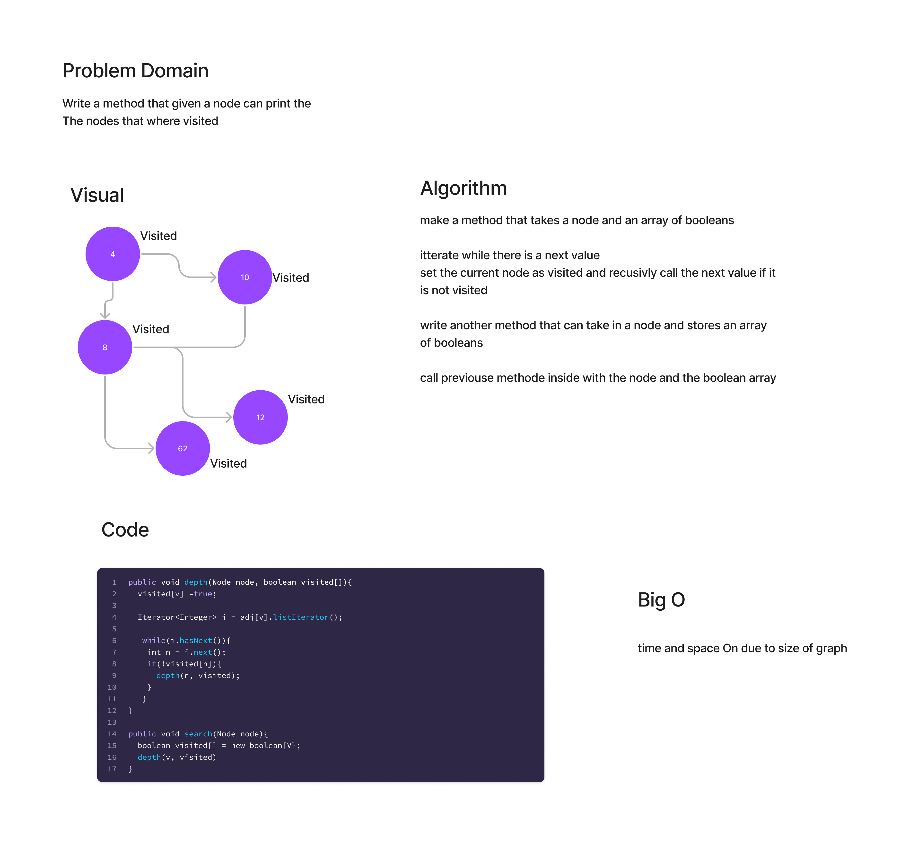
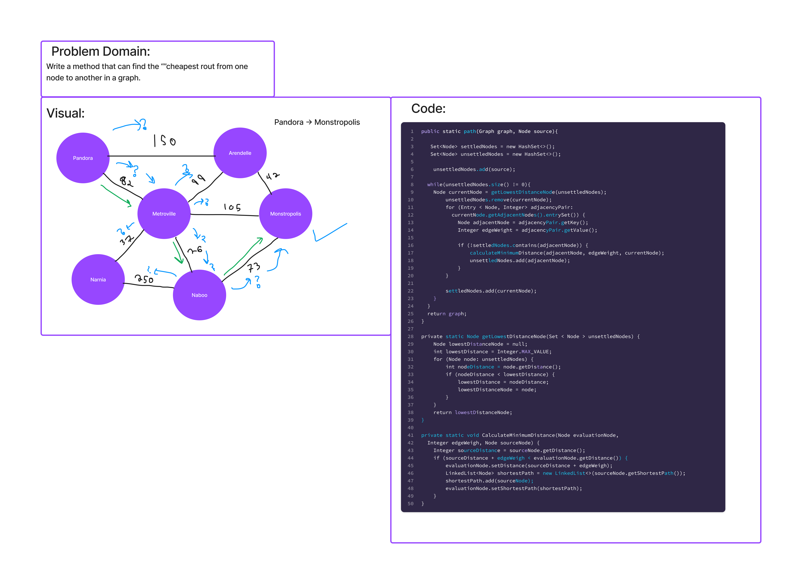
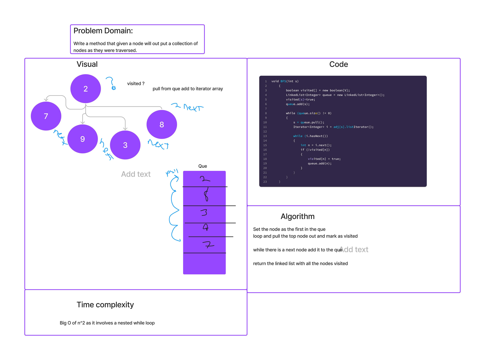

## Challenge
Write a method that given a node can print the The nodes that where visited

## WhiteBoard

## API
Non used at this time

-----------------
## Challenge
Write a method that can find the shortest distences to another point on the graph.

## WhiteBoard

## API
Non used at this time
------
## Challenge
Write a method that given a node will out put a collection of nodes as they were traversed.

## WhiteBoard

## API
Non used at this time
---

## Challenge
Create methodes on a graph to add NOdes and find adjacent nodes

## Approach & Efficiency
For each of the methodes I made lists and maps inorder to store and manipulate the data. most of these have an efficency of
On due to the size of the graph you are going through

## API
Non used at this time
