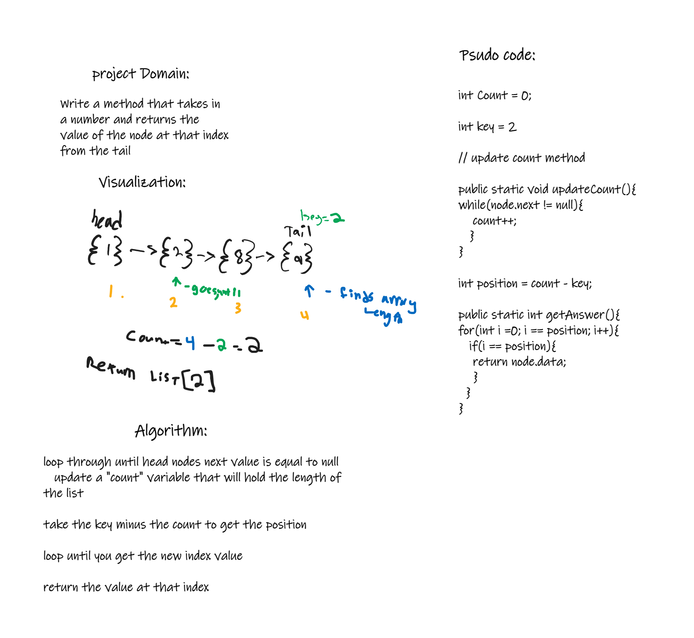
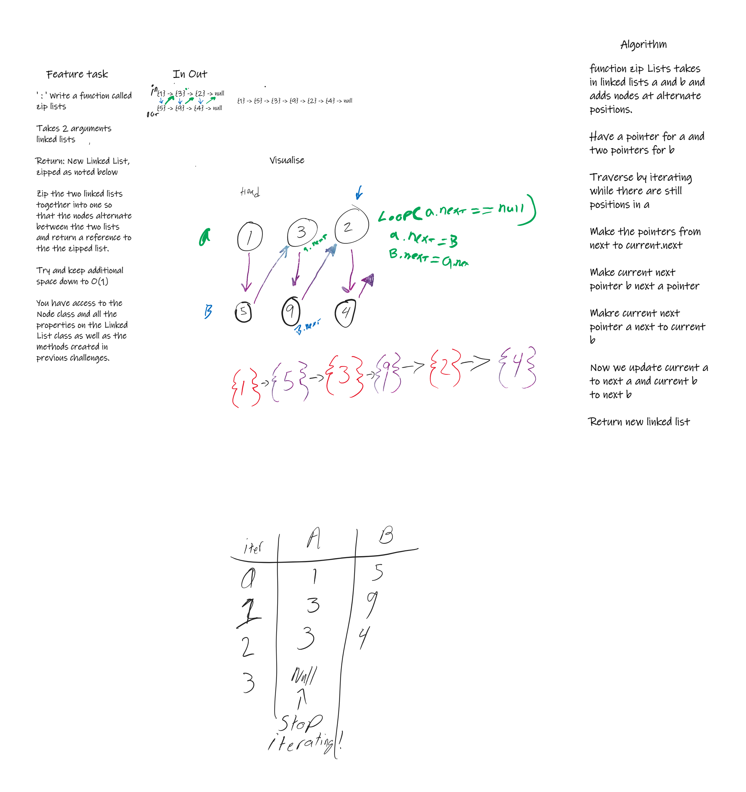

# Challenge Summary
Write a method that takes in a number and returns the value of the node at that index from the tail

## Whiteboard Process

## Approach & Efficiency
for my approach I chose to iterate through the linked list twice. first to establish the length of the list and second to get the value
at the index of the key minuse the lengh of the list. this has an efficiency of On for both gathering the length and getting the value at the key index;

## Solution
Code can be found in the Library class in lib/src/main/java

