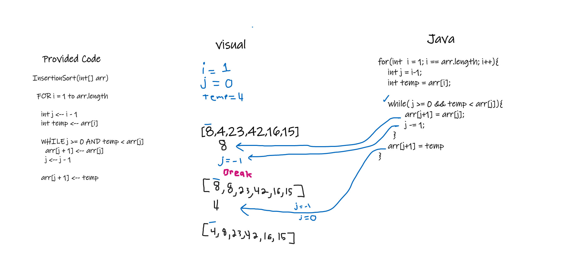

# Blog on sorting

here we see an example of an easy way to sort a given array. after reviewing the psudo code i will break it down step by step:

In the example above we are given an array list of integers. there are three main variables we are tracking in the method these are i,j,and temp.
We start with i equal to 1 so that we can refrence the next value in the array as well as the value we are currently pointing to. This will be made clearer as we move through.

Before we start rearranging things we first have to get our barrings with the variables each time we move to a new position in the array. We do this by setting j equal to i minus one
which will give us the previouse value since array index starts at zero and we set i equal to one.

Next we want to stor the value to swap for later so we called this TEMP.

Now that we have our barrings we are ok to start sorting. we make another loop with the condition that j is not less than 0 and we check that TEMP is less than the elemet we are currently on

As long as these are true we can first set the value of our next element equal to our current element because we know from our logic above that it will be bigger. Then we set j minus one.
this will ensure we dont continually loop.

Once we have set the next value to equal our current value we now have to put our current value equal to the smaller value or rather our TEMP value we do this in a clever way. outside of our
while loop j is still equal to one minues it's self so we simple have to say, the item at j plus one is equal to our temp. Then you continue this logic until you have a sorted array.
