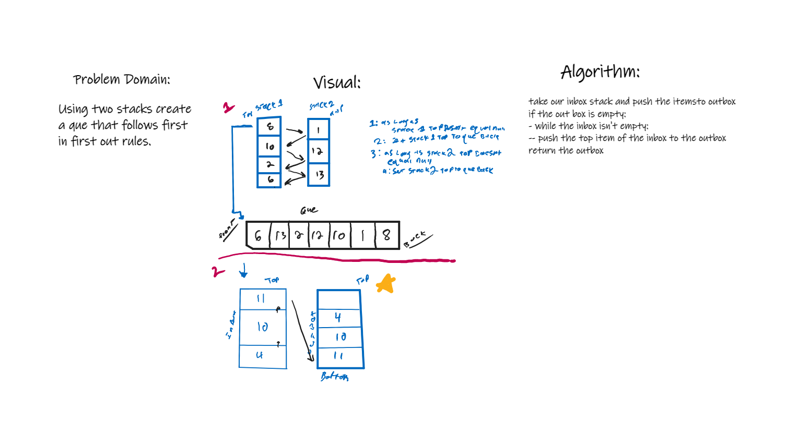

# Stacks and Queues
Animal shelter

## Challenge
create an AnimalShelter class which holds cats and dogs and obays first-in first-out.

write a method for enqueue which takes in an animal

write a method for dequeue which takes in "pref" which can be either cat ordog and returns the first dog or cat based on the "pref" if there aren't any it returns null

## Approach & Efficiency
for enqueue I took the animal node to input and made the tail of the ques equal the input and the animals next equal the tail. this has a time complexity of O(1)

fir dequeue I itterated through the ques and checked if the current animals value was equal to the prefrence variable entered then if it did I returned that animal node. If
the current next value was equal to null I returned null instead. this has a time complexity of On because of the iteration and the unknown size of the que we are working with.
## Whitebord

.png)

## API
no api was used

-----------------------------------------------------------------------------------------------------------------

# Stacks and Queues
Psuedoque with two stacks

## Challenge
Using two stacks create a que which follows the first in first out rule.

## Approach & Efficiency
We can denote one stack as out input stack where we can place all our values and the second stack as an output stack which we
will push values into and that will naturally rearragne the order in the output stack to be first in first out.

## Whitebord

## API
no api was used
