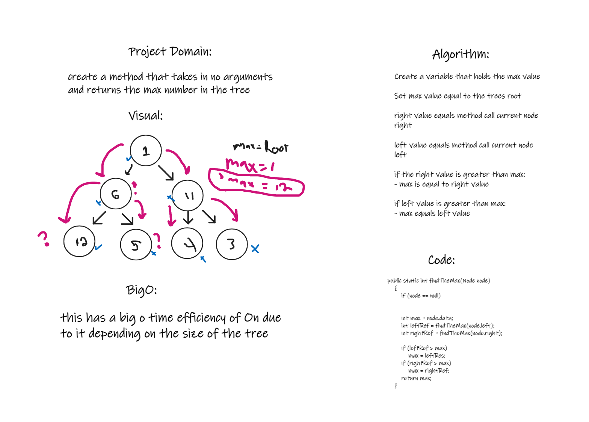

# Trees
Binary tree's Finding the max value

## Challenge
Create a method to find the max value of all nodes in a tree

## Whiteboard

## Approach & Efficiency
I choose to check each nodes right and left values and check them against the stored value called max. if the values were greater it would set max to the current value. this has an efficiencey of On due to the dependency on how large the tree depth is

## API
No api was used

----------------------------------------------------------------------------------------------------------------------------------------------------------------------------------------------------------------------------------------------------------------------
# Trees
Binary tree's and methods

## Challenge
Create a binary tree that has an inOder,preOrder,Postorder,Add,and Contains methods

## Approach & Efficiency
for each method I had the nodes reference a left and right value as well as set up a root and current node. the root node
point to the first node with no previous reference and stays while the current node may change and check values based on the
method it is in. Each Node is stored in an array list to keep track of the tree.
## API
No api was used
