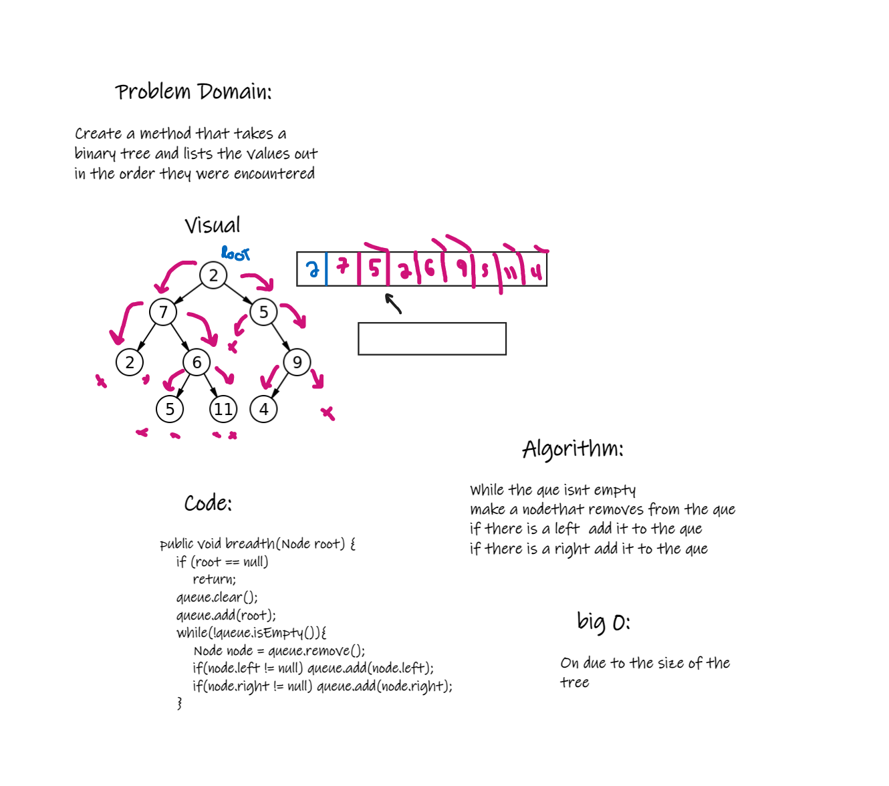

# Trees
N-ary tree

## Challenge
Write a method that takes in a K-ary tree and can check wether the value of the node is divisible by 3 or 5 and returns a key word respectivly. return a new kary tree with the new values

## Whiteboard

## Approach & Efficiency
Wasn't really sure how to do this and the internet was unhelpful. The best bet i could come up with was to travers through each child and check the value and change it based on the conditions provided
this would require the use of a stack and making each node value pop out of the stack and change it's value as we go through each child.
## API
No api was used

-------------------------------------------------------------------------------------------------------------------------------------------------------------------------------------------------------------------------
# Trees
Binary tree's Breadth-first search

## Challenge
Create a method that takes a binary tree and lists the values out in the order they were encountered

## Whiteboard

## Approach & Efficiency
While the que is empty the method makes a node that removes the que, then if there is a left adds that to the que and same for the right. This has a time complexity of On due to the unknown size of the tree

## API
No api was used
-------------------------------------------------------------------------------------------------------------------------------------------------------------------------------------------------------------------------------------------------

# Trees
Binary tree's Finding the max value

## Challenge
Create a method to find the max value of all nodes in a tree

## Whiteboard

## Approach & Efficiency
I choose to check each nodes right and left values and check them against the stored value called max. if the values were greater it would set max to the current value. this has an efficiencey of On due to the dependency on how large the tree depth is

## API
No api was used

----------------------------------------------------------------------------------------------------------------------------------------------------------------------------------------------------------------------------------------------------------------------
# Trees
Binary tree's and methods

## Challenge
Create a binary tree that has an inOder,preOrder,Postorder,Add,and Contains methods

## Approach & Efficiency
for each method I had the nodes reference a left and right value as well as set up a root and current node. the root node
point to the first node with no previous reference and stays while the current node may change and check values based on the
method it is in. Each Node is stored in an array list to keep track of the tree.
## API
No api was used
