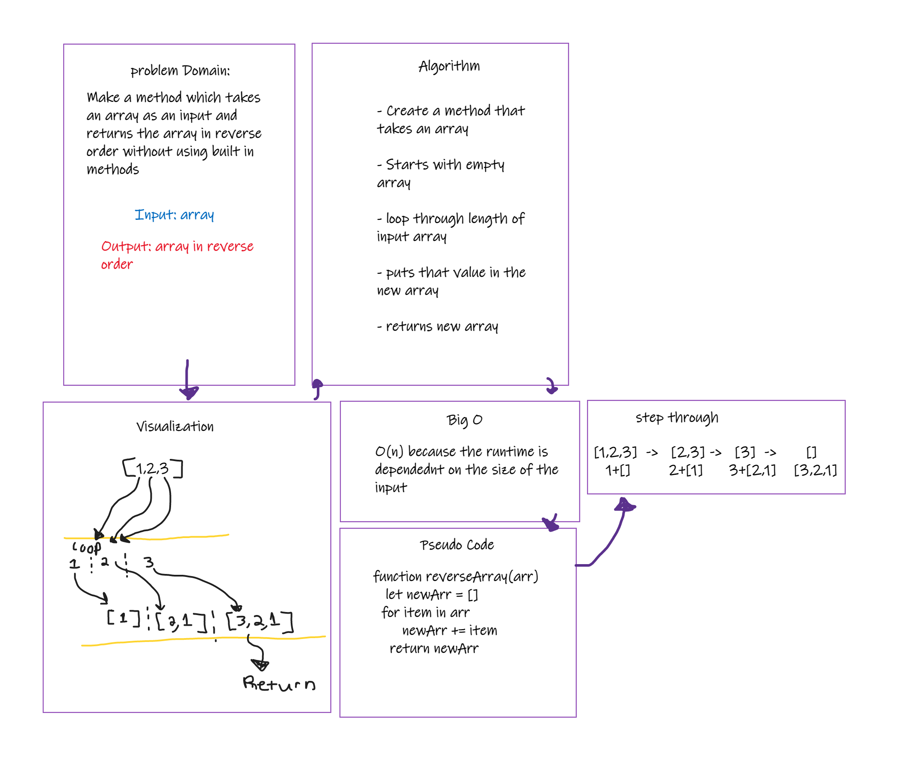
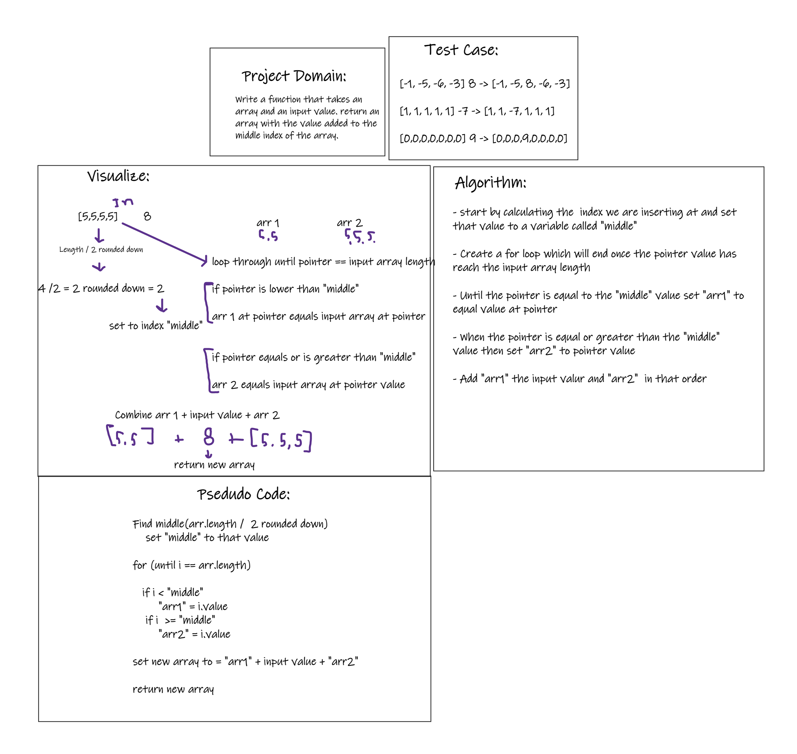

# Reverse an Array

## Whiteboard process

## Approach & Efficiency

The approach I took was to loop through the given array and put each value into a new array which will naturally reverse the order as you loop through each item.
I choose to do it this way because reversing an array is an intrinsic property of adding the current value to a new array through a for loop.
The big O is O(n) or a linear increase as the for loop is completely dependent on the size of the array that you input.

# Insert an input to an array

## Whiteboard process

## Approach

The approach I took was to split the original array into two arrays at the middle then recombine them with the input value at the middle index.
I choose this approach because it seemed like the simplest way to accomplish it without using language specific functions.
