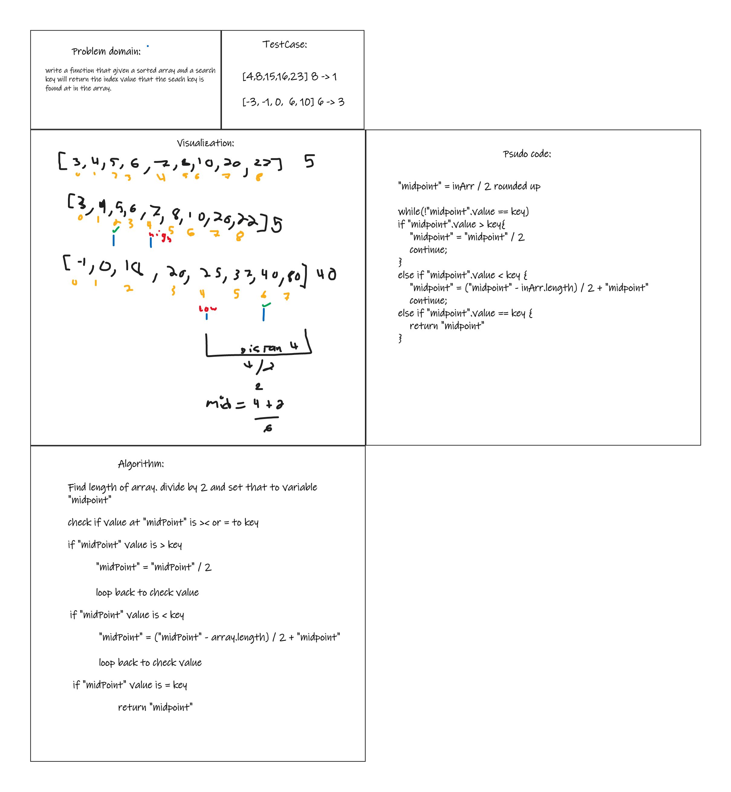

# Binary Searching of Sorted Array

## Whiteboard process

## Approach

I chose to run a loop to check the value at a middle index then update the index value based on weather the value at the middle index was less than or Greater than the key value.
I picked this method because it seem the simplest and most robust way of finding the key cutting in half without having to manipulate the array.

